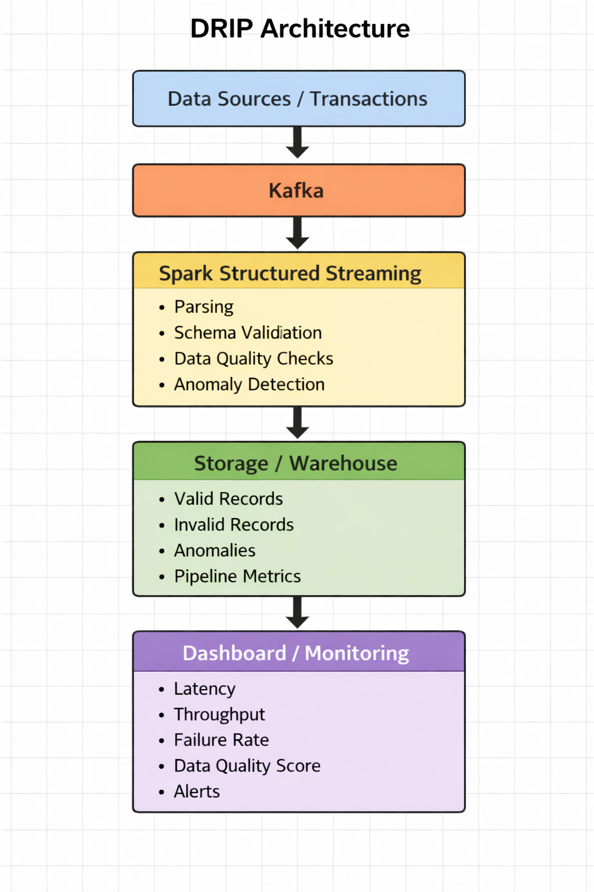

# DRIP: Real-Time Data Reliability Intelligence Platform

A production-style real-time data engineering project built to improve the reliability, quality, and observability of streaming pipelines.

## Overview
DRIP ingests streaming transaction/event data through Kafka, processes it with Spark Structured Streaming, validates schema and data quality rules, detects anomalies in real time, stores curated outputs in a warehouse, and exposes operational KPIs through dashboards.

This project is designed to solve a real industry problem: **unreliable data pipelines**. In modern systems, silent failures, invalid records, delayed events, and poor pipeline visibility can lead to broken dashboards, inaccurate analytics, and costly business decisions.

## Core Features
- real-time data ingestion with Kafka
- stream processing with Spark Structured Streaming
- schema validation and data quality checks
- anomaly detection on live events
- separation of valid, invalid, and anomalous records
- dashboard-ready metrics for monitoring pipeline health

## Architecture
**Data Sources → Kafka → Spark Structured Streaming → Validation & Anomaly Detection → Storage / Warehouse → Dashboard**



## Key KPIs
- pipeline latency
- data quality score
- failure rate
- anomaly detection accuracy
- throughput

## Tech Stack
- Kafka
- PySpark / Spark Structured Streaming
- PostgreSQL / BigQuery / Snowflake
- Streamlit / Power BI
- Airflow
- Docker
- Prometheus / Grafana

## Why This Project Stands Out
- focuses on a real-world data engineering pain point
- combines streaming, validation, anomaly detection, and monitoring
- follows a production-inspired end-to-end architecture
- demonstrates both technical design and system reliability thinking

## Repository Structure
```bash
docs/        # system design and presentation materials
diagrams/    # architecture diagrams
producer/    # data generation and ingestion
streaming/   # Spark processing logic
warehouse/   # storage integration
dashboard/   # visualization layer
monitoring/  # observability and alerts
